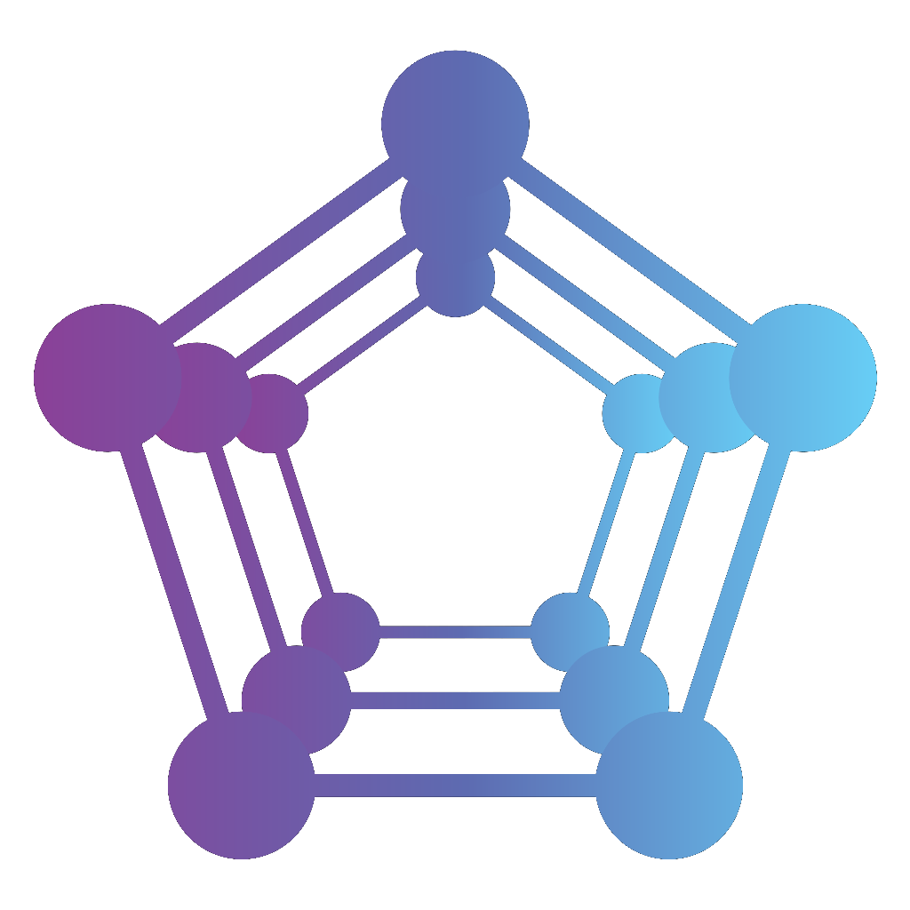

# Axmol Engine

## A Multi-platform Engine for Mobile, Desktop and Xbox.

[Axmol Engine](https://axmol.dev) is an open-source, C++ multi-platform engine designed for mobile devices, desktop, and Xbox, well-suited for 2D game development. It was launched in November 2019 as a fork of Cocos2d-x v4.0.

Please [visit our Wiki](https://github.com/axmolengine/axmol/wiki) to know more about Axmol.

***

  

  

[Chinese ver. / 简体中文](README_CN.md)

***

## ⚡️Building

* [Download the latest release](https://github.com/axmolengine/axmol/releases) / [Mirror](https://gitee.com/simdsoft/axmol)
* [How to install](docs/DevSetup.md)

If you have a Cocos2d-x project, migrating to Axmol Engine is easy. We have prepared a [Migration Guide](https://github.com/axmolengine/axmol/wiki/Cocos2d%E2%80%90x-migration-guide).

## Learning and docs

* [Documentation](https://axmol.dev/manual/latest/)
* [Axmol Wiki](https://github.com/axmolengine/axmol/wiki)
* [Tutorials Page](https://github.com/axmolengine/axmol/wiki/Tutorials)
* [Frequently Asked Questions](https://github.com/axmolengine/axmol/wiki/FAQ)

## General information

Axmol Engine has iterated and improved over the Cocos2d-x v4.0 base. Now is faster and more capable, while staying lightweight. [Check a comparative here](https://github.com/axmolengine/axmol/wiki/Axmol-vs-Cocos2d%E2%80%90x).

**Supported platforms**:
* Mobile: iOS, Android
* Desktop: Windows, Linux, macOS, tvOS
* Console: Xbox (Universal Windows Platform)
* Web: WebAssembly (Preview: [Axmol tests](https://axmol.netlify.app/wasm/cpp-tests/cpp-tests) / [FairyGUI tests](https://axmol.netlify.app/wasm/fairygui-tests/fairygui-tests))

**Languages**:
* C++
* Lua

**Renderer backends**:
* Metal for macOS, iOS and tvOS
* OpenGL 3.3+ for Linux, macOS and Win32
* OpenGL ES 2.0+ for Android
* OpenGL ES 3.0+ for iOS and tvOS
* ANGLE GLES 3.0+ for Win32 and UWP
* WebGL 2.0 (OpenGL ES 3.0): WASM

**Architectures**:
* iOS/tvOS (x64, arm64)
* Android (x86, x64, armv7, arm64)
* Windows (x86, x64)
* Linux (x64)
* OSX (x64, arm64)
* UWP (x64, arm64)
* Wasm32

**Supported 2D physics engines** ([more info here](https://github.com/axmolengine/axmol/wiki/2D-Physics-Engines-Information)):
* Box2D
* Chipmunk2D

**Supported 3D physics engines**:
* Bullet Physics SDK

**Included extensions**:
* FairyGUI
* ImGUI
* Spine
* Live2D
* Effekseer
* And more! Check our [Extensions Wiki Page](https://github.com/axmolengine/axmol/wiki/Extensions)

[More extensions created by our community](https://github.com/axmolengine/axmol/wiki/Made-in-Axmol) 

## Features

Some highlights:

- **New MediaPlayer**: render video as texture2D using MediaEngine. [More info in our Wiki](https://github.com/axmolengine/axmol/wiki/Media-Player).
- Windows video player support (based on Microsoft Media Foundation)
- **WebAssembly support** (by @nowasm) - Preview: [Axmol tests](https://axmol.netlify.app/wasm/cpp-tests/cpp-tests)
- **Universal Windows Platform** (UWP) support for Xbox consoles
- **Apple M1 and Android x64 support** (by @pietpukkel)
- **Windows x64 build support**
- Improved Windows workflow, supporting linking with engine prebuilt libs. Please read the [Windows workflow guide](https://github.com/axmolengine/axmol/issues/564).
- Refactored AudioEngine, OpenAL for all platforms:
    - [OpenAL Soft](https://github.com/kcat/openal-soft) (pass `-DAX_USE_ALSOFT=ON` to CMake to force enabling it)
    - [OpenAL.framework](https://opensource.apple.com/tarballs/OpenAL) (if no `AX_USE_ALSOFT` option specified, cmake script will choose it on OSX/iOS/tvOS, even though it was marked as deprecated is still available)
- Implemented all .wav formats supported by OpenAL Soft (MS-ADPCM, ADPCM, etc.)
- Refactored UserDefault with [mio](https://github.com/mandreyel/mio)
- [Upstream Version License](3rdparty/README.md) - Third-party:
    - Third-party license overview, for easier publishing of your commercial apps based on Axmol framework.
    - Some links to third party libs which support axmol too.
- [Upstream Version License](extensions/README.md) - Extensions:
    - Extensions license overview, for easier publishing of your commercial apps based on Axmol framework.
- Reimplemented HttpClient based on yasio for concurrent http requests processing.
- Modularized all optional extensions, move from engine core folder to an extensions folder.
- Use Google [Angle](https://github.com/google/angle) as default renderer backend on Windows.
- Using GL loader Glad.
- Using [pugixml](https://pugixml.org)
- Using [curl](https://github.com/curl/curl) for transferring data with URL syntax
- Using SAX parser for .plist files
- ASTC 4x4 / 6x6 / 8x8 support (if hardware decoding is not supported, then software decoding is used)
- ETC2 RGB / RGBA support (if hardware decoding is not supported, then software decoding is used)
 
Please read the [full list of changes since Cocos2d-x v4.0](CHANGELOG.md). 

See the [Milestones](https://github.com/axmolengine/axmol/milestones) for planned features.

## Contributions

How to contribute:

* Suggestions, bug fixes, and improvements are highly appreciated!
  - [Instructions for contributing](CONTRIBUTING.md)
  - [Collaborators list](AUTHORS.md)
* Please do not forget to add the topic `axmol` and `axmolengine` to any related repository you create!
* Adding a star on GitHub will help Axmol grow as well. Thank you!

If you find **Axmol Engine** helpful, please consider donating in [Open Collective](https://opencollective.com/axmol) or in [GitHub Sponsors](https://github.com/sponsors/axmolengine). Thank you very much!

## Community

Our community is growing! Please join us at:
 * [GitHub Discussions](https://github.com/axmolengine/axmol/discussions) (preferred way for questions and discussing the engine)
 * [Discord](https://discord.gg/QjaQBhFVay)
 * [Reddit](https://www.reddit.com/r/axmol/)

In order to see some of our community works, please check our Axmol Showcase: [Made in Axmol](https://github.com/axmolengine/axmol/wiki/Made-in-Axmol)

## Reference links

- [1kiss](https://github.com/simdsoft/1kiss): A cross-platform one step build powershell script, with auto setup general dependent tools.
- [axmolengine/glslcc](https://github.com/axmolengine/glslcc): A fork of glslcc, for Axmol new shader workflow tool.
- [Official Cocos2d-x](https://github.com/cocos2d/cocos2d-x)

## Axmol Stats

